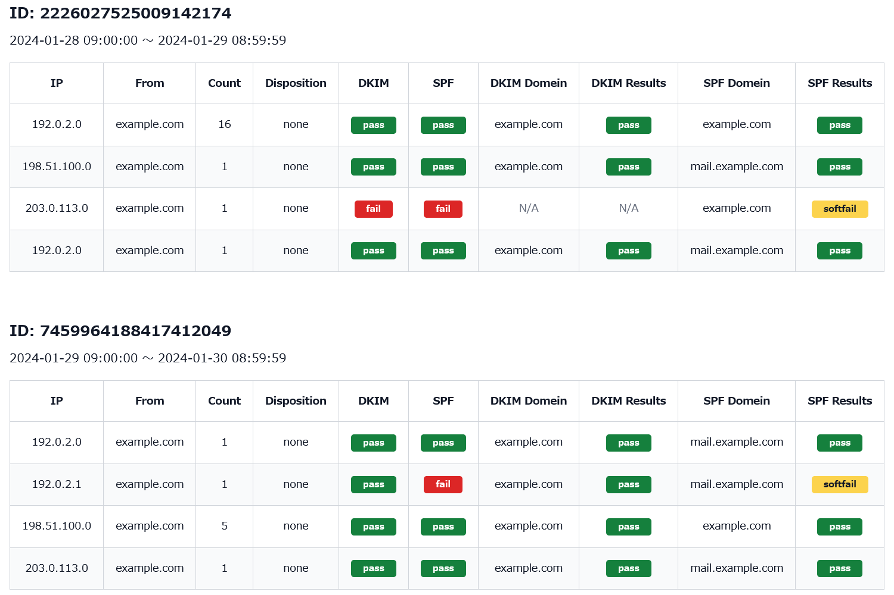

# dmarc-to-html-converter 

Convert DMARC report files from xml to human-readable HTML formats.

DMARC レポート（XML）を人間が読みやすい HTML 形式に変換するスクリプトです。指定のディレクトリに DMARC レポート（.zip / .gz / .xml）を置いた状態でスクリプトを実行すると、それらすべてから内容を抽出し、まとめた HTML ファイルを生成します。

## Getting Started

Install Node.js if you haven't already.

```sh
git clone https://github.com/burnworks/dmarc-to-html-converter.git
cd dmarc-to-html-converter
npm install
```

### Create `report` directory

Please create a `report` directory in the root directory of the project and save DMARC reports (either .zip or .gz or .xml) there.

`report` というディレクトリをプロジェクトのルートディレクトリに作成し、そこに DMARC レポート（.zip / .gz / .xml）を保存してください。

### Run Script

```sh
npm run dev
```

When the script is executed successfully, a report.html file will be generated in the root directory of the project. Please open this file in a browser.

スクリプトが正しく実行されると、プロジェクトのルートディレクトリに `report.html` が生成されます。このファイルをブラウザで開いてください。

### Report sample

下記はレポートのサンプル画像です。`report` ディレクトリに置いてあるファイルを作成日時順（日時が新しいレポートが HTML では上に表示されます）に処理していくはずです。



### 注意点

Google と Microsoft から送信される DMARC レポートのフォーマットを参考に開発しています （[DMARC レポートについて](https://support.google.com/a/answer/10032472)）。フォーマットの違いによっては正しく変換されないかもしれません。  
また数百件、数千件のレポートを変換することを想定していません。主に、中小企業、あるいは零細企業レベルでの利用しか想定していませんので、大きなレポートを解析したい場合は、専用の有料サービスをご利用ください。
